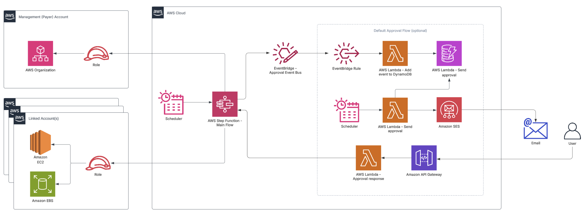
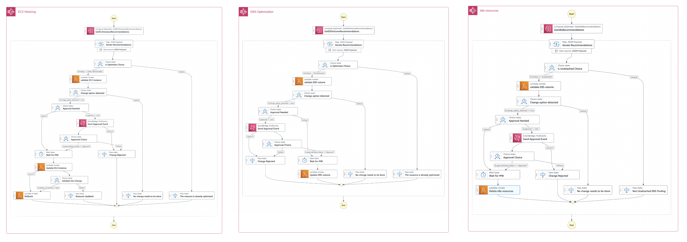

# AWS Compute Optimizer Automation (AWS COA)

AWS Compute Optimizer Automation (AWS COA) automates the process of implementing recommendations from AWS Compute Optimizer, enabling you to efficiently optimize your AWS resources and reduce costs across your entire AWS Organization. AWS Compute Optimizer is a service that analyzes the configurations and utilization data of your AWS resources to provide optimization recommendations. However, many customers find it challenging to fully capitalize on the potential savings due to the manual effort and time required to apply these recommendations. AWS COA takes these recommendations and applies them automatically, following your defined risk profile and approval processes.

# Key Benefits

* **Cost Savings:** AWS COA helps you identify and address overprovisioned resources, leading to cost savings in your AWS Organization.

* **Automated Optimization:** The solution automates the process of evaluating and applying recommendations, reducing the burden on your team and ensuring your resources are consistently optimized.

* **Risk Profile Management:** AWS COA allows you to set a risk profile, ensuring that only recommendations aligned with your predefined risk level are automatically applied.

* **Enhanced User Control:** With optional approval features, you can obtain user approval before any resource changes are implemented, providing greater control and oversight.

* **Organization-Wide Management:** AWS COA can manage resources across all accounts in your AWS Organization, providing a centralized optimization solution.

# Architecture

The AWS COA architecture is built around AWS Step Functions, which efficiently handle the optimization process across your entire AWS Organization. Here's how it works:

1. **Organization Discovery:** AWS COA discovers all accounts and regions in your AWS Organization, or uses a predefined list if provided.

2. **Data Collection:** AWS COA uses data from AWS Compute Optimizer that analyzes your AWS resources and generates optimization recommendations for each account and region.

3. **Parallel Processing:** Each account and region is processed in parallel, with each resource recommendation further processed in parallel to determine if it corresponds to an overprovisioned resource and whether it aligns with your defined risk profile.

4. **Optional User Approval:** If enabled, AWS COA sends an approval request via EventBridge, SES, DynamoDB, and API Gateway before making any changes. This ensures you have the final say in resource modifications.

5. **Maintenance Window:** The solution waits until the next maintenance window before applying any changes to your resources. This allows for controlled and scheduled updates, minimizing disruption.

# Supported Automations

AWS COA currently supports the following automation processes:

1. **Resizing overprovisioned EC2 instances** – Automatically adjusts instance types based on AWS Compute Optimizer recommendations to improve efficiency and reduce costs.

2. **Optimizing EBS volumes** – Adjusts EBS volume attributes such as type, IOPS, and throughput to align with usage patterns and cost efficiency.

3. **Deleting unattached idle EBS volumes** – Identifies and removes EBS volumes that are no longer attached to any instance and have been flagged as idle by AWS Compute Optimizer.

# Getting Started

Follow these steps to get started with AWS COA:

1. **Configure AWS Compute Optimizer:** Ensure AWS Compute Optimizer is enabled and configured to analyze your AWS resources.

2. **Deploy the Main Stack in the Automation Account:** The main AWS COA stack must be deployed in the account that will serve as your automation account. This stack includes all the automation components such as Step Functions, Lambda functions, and the optional approval flow (SES, DynamoDB, and API Gateway).

    You can deploy this stack using the provided CloudFormation template:

    * Template Location: [AWS-Compute-Optimizer-Automation.yml](/src/cf-template/AWS-Compute-Optimizer-Automation.yml)
    
    * Quick Deploy: 
        
        

    During this stack deployment, you'll need to specify various parameters that define how the automation works:

    - **General Configuration**

        - **Risk Profile:** Define the level of risk acceptable for automated resource changes.

        - **Approval Required:** Specify whether an approval request should be sent before making any changes.

        - **Automate EBS Recommendations:** Choose whether to automate EBS recommendations from AWS Compute Optimizer.

        - **Automate Idle Recommendations:** Specify whether to automate the deletion of unattached EBS volumes identified as idle by AWS Compute Optimizer.

        - **AutomateEC2Recommendations:** Choose whether to automate EC2 recommendations from AWS Compute Optimizer.

        - **Create EBS Snapshot:** Specify whether to take a snapshot before upgrading an EC2 instance.

    - **Approval Flow Configuration**

        - **Deploy Default Approval Flow:** Specify whether to launches the approval flow that uses SES and API Gateway.

        - **Default SES Email:** Email address to receive notifications from AWS COA as part of the default approval flow.

        - **Approver Tag Key:** Define the tag used to identify who needs to receive the approval for the resource
    
    - **Maintenance Window Configuration**

        - **Maintenance Day:** Specify the day for making changes to resources during the maintenance window.

        - **Maintenance Time (UTC):** Specify the time (UTC) for making changes to resources during the maintenance window.

    - **Resource Filtering**

        - **Exclusion Tag Key:** Define the tag used to identify resources that should be excluded from optimization.

3. **Deploy Cross-Account Permissions in the Management Account:** After deploying the main stack, you must deploy the permissions template as a StackSet from your AWS Organization's management account. This StackSet will create the necessary IAM roles in all member accounts to allow the automation account to access and modify resources.

    You can deploy this stack using the provided CloudFormation template:

    * Template Location: [AWS-COA-Cross-Account-Permissions.yml](/src/cf-template/AWS-COA-Cross-Account-Permissions.yml)
    
    * Quick Deploy: 

        

    During the StackSet deployment, you'll need to specify:

    - **AWS COA Main Account ID:** The AWS account ID where the main AWS COA stack was deployed (automation account). This is required to establish the trust relationship for cross-account access.

4. **Optional: Provide Account and Region List:** If you want to limit which accounts and regions the automation runs on, you can provide a list as an SSM parameter document named `'/coa/coa-accounts-regions'`. If this list is provided, the automation won't connect to the management account and will only use the provided data.

5. **Resource Optimization:** AWS COA will automatically evaluate the recommendations every week and apply the relevant recommendations during the designated maintenance window. This ensures that your resources are consistently optimized without manual intervention.

6. **Optional User Approval (If Enabled):** If user approval is enabled, AWS COA will send approval requests before implementing changes. The approval flow uses the resource tags to determine the correct approver email. If no approver tag is found, the approval request is sent to the default email defined in the stack.

# Limitations

While AWS COA is a powerful solution for optimizing EC2 instances and reducing costs, it has certain limitations to consider:

1. **Limited to EC2 Instances and EBS Volumes:** Currently, AWS COA applies recommendations only to EC2 instances and EBS volumes, including optimizations for volume type, IOPS, and throughput, as well as the deletion of idle volumes. We plan to expand support for additional AWS services in future updates.

2. **Recommendation Accuracy with CloudWatch Agent:** To ensure accurate recommendations, it is highly recommended to have the CloudWatch agent installed on all your instances. This allows AWS Compute Optimizer to consider memory usage alongside other metrics when generating recommendations.

3. **Exclusion of Hypervisor Upgrades:** AWS COA does not apply recommendations that require hypervisor upgrades. These upgrades may require manual intervention and must be considered separately.

4. **Lack of Workload and Vendor Knowledge:** The solution does not have knowledge of specific workloads, software requirements, or vendor recommendations and licensing terms. Before applying any optimization on EC2 instances, users should make informed decisions, taking into account support and licensing implications.

5. **Architectural Requirements:** It's essential to consider specific architectural requirements. For instance, if you have two instances in different availability zones that need to be identical for proper cluster functionality, you can use the ExcludeTag feature in AWS COA to prevent any potential cluster mismatch.

6. **Analysis Period:** By default, AWS Compute Optimizer uses the last 14 days of metrics to generate recommendations. However, you have the option to expand the analysis period to 90 days by activating [enhanced infrastructure metrics](https://docs.aws.amazon.com/compute-optimizer/latest/ug/enhanced-infrastructure-metrics.html). This extended period allows for more comprehensive and accurate recommendations.

Please be mindful of these limitations while using AWS COA to ensure a smooth optimization process and to align with your organization's specific needs.

# Contribution

We welcome contributions from the community to enhance AWS COA. If you encounter any issues, have ideas for improvement, or want to report a bug, please submit a pull request or open an issue in the repository.

# License

AWS COA is released under the MIT-0 License.

# 

With AWS COA, you can efficiently manage your AWS resources and optimize costs without the hassle of manual intervention. Start maximizing your AWS savings today with AWS COA!
