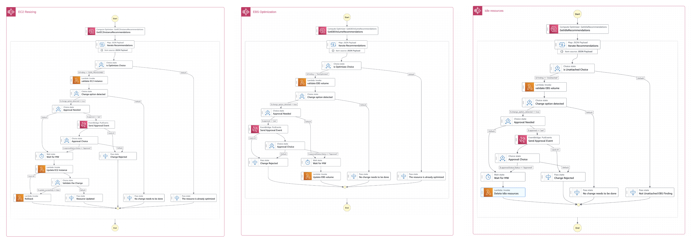

# AWS Compute Optimizer Automation (AWS COA)

AWS Compute Optimizer Automation (AWS COA) automates the process of implementing recommendations from AWS Compute Optimizer enabling you to efficiently optimize your AWS resources and reduce costs. AWS Compute Optimizer is a service that analyzes the configurations and utilization data of your AWS resources to provide optimization recommendations. However, many customers find it challenging to fully capitalize on the potential savings due to the manual effort and time required to apply these recommendations.

# Key Benefits

* **Cost Savings:** AWS COA helps you identify and address overprovisioned resources, leading to cost savings in your AWS environment.

* **Automated Optimization:** The solution automates the process of evaluating and applying recommendations, reducing the burden on your team and ensuring your resources are consistently optimized.

* **Risk Profile Management:** AWS COA allows you to set a risk profile, ensuring that only recommendations aligned with your predefined risk level are automatically applied.

* **Enhanced User Control:** With optional approval features, you can obtain user approval before any resource changes are implemented, providing greater control and oversight.

# Architecture

The AWS COA architecture is built around an AWS Step Function, which efficiently handles the optimization process. Here's how it works:

1. **Data Collection:** AWS Compute Optimizer analyzes your AWS resources and generates optimization recommendations.

2. **Parallel Processing:** Each resource recommendation is processed in parallel by AWS COA to determine if it corresponds to an overprovisioned resource and whether it aligns with your defined risk profile.

3. **Optional User Approval:** If enabled, AWS COA sends an approval request via EventBridge, SNS and API Gateway before making any changes. This ensures you have the final say in resource modifications.

4. **Maintenance Window:** The solution waits until the next maintenance window before applying any changes to your resources. This allows for controlled and scheduled updates, minimizing disruption.

5. **Rollback:** In case of any errors during the update process, AWS COA automatically rolls back the resource to its original configuration and notifies the user about the issue.

# Supported Automations

AWS COA currently supports the following automation processes:

1. **Resizing overprovisioned EC2 instances** – Automatically adjusts instance types based on AWS Compute Optimizer recommendations to improve efficiency and reduce costs.

2. **Optimizing EBS volumes** – Adjusts EBS volume attributes such as type, IOPS, and throughput to align with usage patterns and cost efficiency.

3. **Deleting unattached idle EBS volumes** – Identifies and removes EBS volumes that are no longer attached to any instance and have been flagged as idle by AWS Compute Optimizer.

# Getting Started

Follow these steps to get started with AWS COA:

1. **Configure AWS Compute Optimizer:** Ensure AWS Compute Optimizer is enabled and configured to analyze your AWS resources.

2. **Set Up AWS COA:** Use AWS CloudFormation to deploy the AWS COA solution. You can deploy the solution using the provided CloudFormation template available at [AWS-Compute-Optimizer-Automation.yml](src/cf-template/AWS-Compute-Optimizer-Automation.yml). This template includes the required AWS Step Functions, Lambda functions, and an optional default approval flow that uses SNS and API Gateway.

    

3. **Stack name:** Enter a name for the stack to be created.

4. **Define Parameters:** During the CloudFormation deployment, you'll need to specify various parameters that align with your organization's preferences for automatic resource changes. These parameters include:

    - **ApprovalRequired:** Specify whether an approval request should be sent before making any changes.

    - **ArchitecturalChange:** Indicate whether processor changes should be considered.

    - **AutomateEBSRecommendations:** Choose whether to automate EBS recommendations from AWS Compute Optimizer.

    - **AutomateEC2Recommendations:** Choose whether to automate EC2 recommendations from AWS Compute Optimizer.

    - **AutomateIdleRecommendations:** Specify whether to automate the deletion of EBS volumes identified as idle by AWS Compute Optimizer.

    - **DefaultApprovalFlow:** Launches a sample approval flow using SNS and API Gateway.

    - **EBSSnapshot:** Specify whether to take a snapshot before upgrading an EC2 instance.

    - **Email:** Email address to receive notifications from AWS COA as part of the default approval flow.

    - **ExcludeTag:** Define the tag used to identify resources that should be excluded from optimization.

    - **MaintenanceWindowDay:** Specify the day for making changes to resources during the maintenance window.

    - **MaintenanceWindowTime:** Specify the time (UTC) for making changes to resources during the maintenance window.

    - **RiskProfile:** Define the level of risk acceptable for automated resource changes.

5. **Resource Optimization:** AWS COA will automatically evaluate the recommendations every other week and apply the relevant recommendations during the designated maintenance window. This ensures that your resources are consistently optimized without manual intervention.

6. **Optional User Approval (If Enabled):** If user approval is enabled during the CloudFormation setup, an EventBridge event will be created to approve or reject resource changes before they are implemented. This additional layer of control ensures that you have the final say in resource modifications.

    * If you are using the 'DefaultApprovalFlow', an EventBridge rule will be configured to capture the event. Subsequently, using SNS and API Gateway, a notification will be sent to request the approval or rejection of the change.

    * The EventBridge event can also be utilized for integrating with other approval flows.

# Limitations

While AWS COA is a powerful solution for optimizing EC2 instances and reducing costs, it has certain limitations to consider:

1. **Limited to EC2 Instances and EBS Volumes:** Currently, AWS COA applies recommendations only to EC2 instances and EBS volumes, including optimizations for volume type, IOPS, and throughput, as well as the deletion of idle volumes. We plan to expand support for additional AWS services in future updates.

2. **Recommendation Accuracy with CloudWatch Agent:** To ensure accurate recommendations, it is highly recommended to have the CloudWatch agent installed on all your instances. This allows AWS Compute Optimizer to consider memory usage alongside other metrics when generating recommendations.

3. **Exclusion of Hypervisor Upgrades:** AWS COA does not apply recommendations that require hypervisor upgrades. These upgrades may require manual intervention and must be considered separately.

4. **Lack of Workload and Vendor Knowledge:** The solution does not have knowledge of specific workloads, software requirements, or vendor recommendations and licensing terms. Before applying any optimization on EC2 instances, users should make informed decisions, taking into account support and licensing implications.

5. **Architectural Requirements:** It's essential to consider specific architectural requirements. For instance, if you have two instances in different availability zones that need to be identical for proper cluster functionality, you can use the ExcludeTag feature in AWS COA to prevent any potential cluster mismatch.

6. **Analysis Period:** By default, AWS Compute Optimizer uses the last 14 days of metrics to generate recommendations. However, you have the option to expand the analysis period to 90 days by activating [enhanced infrastructure metrics](https://docs.aws.amazon.com/compute-optimizer/latest/ug/enhanced-infrastructure-metrics.html). This extended period allows for more comprehensive and accurate recommendations.

Please be mindful of these limitations while using AWS COA to ensure a smooth optimization process and to align with your organization's specific needs.

# Contribution

We welcome contributions from the community to enhance AWS COA. If you encounter any issues, have ideas for improvement, or want to report a bug, please submit a pull request or open an issue in the repository.

# License

AWS COA is released under the MIT-0 License.

# 

With AWS COA, you can efficiently manage your AWS resources and optimize costs without the hassle of manual intervention. Start maximizing your AWS savings today with AWS COA!
